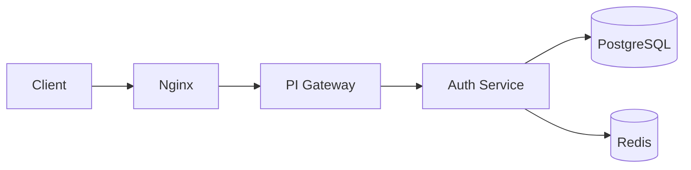
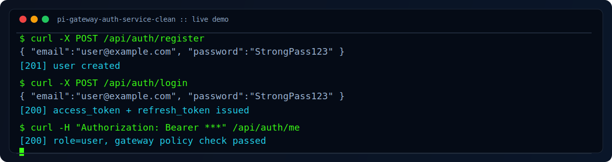

# PI Gateway + Auth Service

Я сделал этот проект как демонстрацию production-подхода к backend-безопасности: отдельный сервис авторизации + API gateway для микросервисной архитектуры.

## Что реализовал

- JWT-авторизацию с `access` и `refresh` токенами.
- Ротацию refresh-токенов и их отзыв при logout.
- Ролевую модель (`user`, `admin`).
- Rate limiting через Redis для `register/login`.
- Audit log в PostgreSQL.
- Проверку токена и ролей на уровне API Gateway.
- Проксирование через Nginx как единую входную точку.

## Стек

- FastAPI
- PostgreSQL
- Redis
- Nginx
- Pytest

## Архитектура



## Demo



```bash
# 1) register
curl -X POST http://localhost:8080/api/auth/register \
  -H 'content-type: application/json' \
  -d '{"email":"user@example.com","password":"StrongPass123"}'

# 2) login
curl -X POST http://localhost:8080/api/auth/login \
  -H 'content-type: application/json' \
  -d '{"email":"user@example.com","password":"StrongPass123"}'

# 3) me (with access token)
curl -X GET http://localhost:8080/api/auth/me \
  -H "Authorization: Bearer <ACCESS_TOKEN>"
```

## Сервисы и маршруты

- `auth_service`
  - `POST /auth/register`
  - `POST /auth/login`
  - `POST /auth/refresh`
  - `POST /auth/logout`
  - `GET /auth/me`
  - `GET /admin/users` (только `admin`)
  - `GET /admin/audit` (только `admin`)
- `gateway`
  - `ANY /api/{path}` проксирует запросы в auth service
  - проверяет bearer token на непубличных маршрутах
- `nginx`
  - входная точка на `:8080`

## Быстрый запуск

```bash
cd /Users/unw4rd3n/Documents/test/pi-gateway-auth-service
cp .env.example .env
docker compose up --build
```

Проверка health:
- `http://localhost:8001/health` (gateway)
- `http://localhost:8000/health` (auth)
- `http://localhost:8080` (nginx ingress)

## Тесты

```bash
cd /Users/unw4rd3n/Documents/test/pi-gateway-auth-service
python -m pip install -e '.[dev]'
pytest -q
```

## Пример сценария

```bash
# Регистрация
curl -X POST http://localhost:8080/api/auth/register \
  -H 'content-type: application/json' \
  -d '{"email":"user@example.com","password":"StrongPass123"}'

# Логин
curl -X POST http://localhost:8080/api/auth/login \
  -H 'content-type: application/json' \
  -d '{"email":"user@example.com","password":"StrongPass123"}'
```

## Что показывает этот проект

В этом проекте я показываю, что умею строить:
- безопасный backend с понятной auth-моделью,
- gateway-слой для микросервисов,
- практики production-разработки: логирование, ограничение запросов, тесты.
